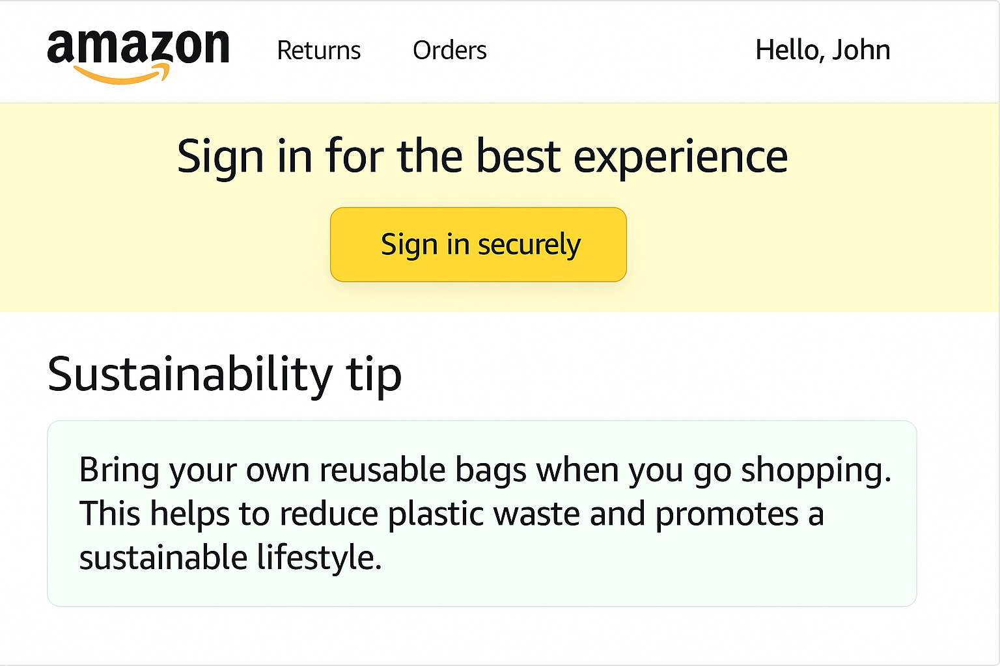

# 🌱 Virtual Green Assistant – AI Sustainability Copilot

This project is a **prototype** for a sustainable shopping assistant integrated to Amazon. It uses **Azure OpenAI's GPT-o3 model** to generate real-time, personalized insights that encourage eco-friendly behavior.

> ⚠️ This is a **backend + concept-only prototype** with API mocks, screenshots for demo, and intelligent logic powered by LLMs.

---

## 📸 Demo Screenshots

| API             | Placement             | Screenshot |
|------------------|------------------------|------------|
| `/eco-swap`      | Product Detail Page     |  |
| `/user-impact`   | Profile/Your Account    |  |
| `/generate-tip`  | Homepage Feed Section   |  |
| `/recommend-next`| Post-Purchase Checkout  |  |

---

## 💡 Key Features

| Feature                   | Description |
|----------------------------|-------------|
| 🔁 **/eco-swap**           | Suggests greener alternatives with AI-generated justification, CO₂/plastic savings, and a confidence score. |
| 👤 **/user-impact**        | Personalized sustainability dashboard: total swaps, challenges, savings, badges, eco-coins. |
| 🌱 **/generate-tip**       | Contextual sustainability tips based on recent items. |
| 👉 **/recommend-next**     | Suggests the next impactful eco-action after a purchase. |

---

## 🧠 Powered By

- **Azure OpenAI (GPT-o3)**
- **FastAPI** backend with automatic Swagger UI
- Rich prompt design with structured JSON output

---

## 🛠️ Setup Instructions

### 🔧 1. Install Dependencies

```bash
pip install fastapi uvicorn openai
```

### 🔑 2. Set Environment Variables

```bash
export AZURE_OPENAI_ENDPOINT="https://<your-endpoint>.openai.azure.com/"
export AZURE_OPENAI_KEY="<your-api-key>"
export AZURE_DEPLOYMENT_NAME="<your-deployment-name>"
```

### 🚀 3. Run Server

```bash
uvicorn greengen:app --reload
```

Open: [http://localhost:8000/docs](http://localhost:8000/docs) for Swagger UI.

---

## 📦 API Summary

### `POST /eco-swap`

Suggest a greener alternative to a given product.

```json
{
  "product": "plastic toothbrush"
}
```

Returns:

```json
{
  "eco_alternative": "bamboo toothbrush",
  "co2_saved": "1.2",
  "plastic_saved": "30",
  "ai_reasoning": "Bamboo is biodegradable...",
  "confidence_score": 0.92,
  "amazon_link": "https://amazon.com/bamboo-toothbrush"
}
```

---

### `GET /user-impact?user_id=user123`

Returns impact summary for a user.

```json
{
  "total_swaps": 18,
  "co2_saved": "22kg",
  "plastic_avoided": "2.3kg",
  "badges": ["Plastic-Free Hero", "CO2 Slayer"],
  "eco_coins": 1320
}
```

---

### `POST /generate-tip`

```json
{
  "recent_items": ["detergent bottle", "plastic wrap"]
}
```

Returns:

```json
{
  "tip": "Reuse detergent bottles as planters",
  "category": "Upcycling"
}
```

---

### `POST /recommend-next`

```json
{
  "user_id": "user123",
  "history": ["bamboo brush", "jute bag"]
}
```

Returns:

```json
{
  "recommended_action": "Switch to compostable phone case",
  "reason": "Reduces 1.5kg plastic and 3.2kg CO2",
  "estimated_co2_saved": 3.2,
  "estimated_plastic_saved": 150
}
```

---

## 📈 Scalability & Extensibility

- Built on **FastAPI** – microservice ready
- Each feature is modular (eco-swaps, nudges, dashboards)
- Easily integrates with frontend (React, Android, iOS)
- Cloud-native for deployment via Render, Railway, AWS

---

## 📁 File Structure

```
📦 root/
┣ 📄 greengen.py   # Main app
┣ 📁 public/
┃ ┣ eco-swap.png
┃ ┣ user-impact.png
┃ ┣ generate-tip.png
┃ ┗ recommend-next.png
┣ 📄 README.md
```

---

## 🧪 Testing

- Run using Swagger UI or Postman
- Sample payloads included in `/docs`

---

## 💚 Vision

Helping every user turn small sustainable choices into **measurable impact**.

> “Make sustainability the default, not the effort.”
